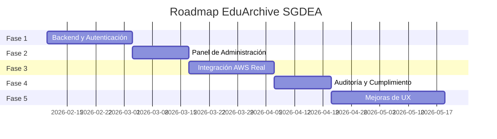

<div align="center">

# 📁 EduArchive SGDEA

### Sistema de Gestión de Documentos Electrónicos de Archivo

**Reporte de Características y Propuesta de Mejoras**

---

| 📅 Fecha | 📌 Versión | 📋 Tipo |
|:--------:|:----------:|:-------:|
| 7 de febrero de 2026 | 1.0 | Documento Técnico |

</div>

---

## 📋 Tabla de Contenidos

1. [Resumen Ejecutivo](#1-resumen-ejecutivo)
2. [Estado Actual del Proyecto](#2-estado-actual-del-proyecto)
3. [Funcionalidades Pendientes](#3-funcionalidades-pendientes)
4. [Propuesta de Mejoras](#4-propuesta-de-mejoras-y-funciones-adicionales)
5. [Roadmap de Implementación](#5-roadmap-de-implementación-sugerido)
6. [Requisitos Técnicos](#6-requisitos-técnicos-para-supabase)
7. [Conclusiones](#7-conclusiones)

---

## 1. Resumen Ejecutivo

EduArchive SGDEA es un sistema de gestión documental diseñado para instituciones educativas, con capacidad para manejar cuatro áreas críticas:

| Área | Descripción |
|:-----|:------------|
| 🎓 **Gestión Académica** | Expedientes estudiantiles, certificados, actas de grado |
| 👥 **Talento Humano** | Historias laborales, contratos, evaluaciones |
| 💰 **Gestión Contable/Financiera** | Facturas, comprobantes, estados financieros |
| 🏛️ **Gestión Administrativa** | Actas, resoluciones, correspondencia oficial |

### Cumplimiento Normativo

El sistema está concebido para cumplir con:

| Normativa | Descripción |
|:----------|:------------|
| **Ley 594 de 2000** | Ley General de Archivos |
| **Ley 1581 de 2012** | Protección de Datos Personales |
| **Acuerdo 002 de 2014** | Criterios básicos para gestión de documentos electrónicos (AGN) |

---

## 2. Estado Actual del Proyecto

### 2.1 Módulos Implementados

| Módulo | Estado | Descripción |
|:-------|:------:|:------------|
| 📊 Dashboard | ✅ | Panel con métricas, gráficos y registro de actividades |
| 🎓 Gestión Académica | ✅ | Expediente único del estudiante |
| 👥 Talento Humano | ✅ | Historias laborales |
| 💰 Contable y Financiero | ✅ | Documentos contables |
| 🏛️ Administrativo | ✅ | Actas, resoluciones y correspondencia |
| 🔍 Búsqueda Semántica | ✅ | Búsqueda con IA (Gemini) + filtros avanzados |

> **Leyenda:** ✅ Funcional | ⚠️ Parcial | ❌ Pendiente

---

### 2.2 Características Implementadas

#### 🖥️ Frontend (React + TypeScript + Vite)

<details>
<summary><strong>📱 Sidebar de Navegación</strong></summary>

- Menú lateral con acceso a todos los módulos
- Indicadores visuales de módulo activo
- Colapso responsive
</details>

<details>
<summary><strong>📊 Dashboard Interactivo</strong></summary>

| Componente | Descripción |
|:-----------|:------------|
| Tarjetas de métricas | Documentos, Almacenamiento, Retención, Alertas |
| Gráfico de barras | Ingreso de documentos últimos 6 meses (Recharts) |
| Feed de actividades | Registro simulando CloudTrail |
</details>

<details>
<summary><strong>📄 Vista de Módulos (ModuleView)</strong></summary>

| Característica | Estado |
|:---------------|:------:|
| Tabla de documentos con búsqueda en tiempo real | ✅ |
| Estados de documentos (Gestión, Central, Histórico, Bloqueado, Firmado) | ✅ |
| Sistema de etiquetas (tags) | ✅ |
| Indicador de foliación electrónica | ✅ |
</details>

<details>
<summary><strong>📤 Carga Masiva de Documentos</strong></summary>

| Función | Descripción |
|:--------|:------------|
| Drag & Drop | Arrastre de múltiples archivos |
| Análisis IA | Extracción automática de metadatos |
| Procesamiento por lotes | Modal de progreso visual |
</details>

<details>
<summary><strong>👁️ Vista Previa de Documentos</strong></summary>

| Pestaña | Contenido |
|:--------|:----------|
| Metadatos | Información completa del documento |
| Versiones | Historial de cambios |
| Notas | Comentarios y anotaciones |
| Relaciones | Vínculos con otros documentos |
| Permisos | Control de acceso por rol |
| Firma | Estado de firma digital |
</details>

<details>
<summary><strong>🔍 Búsqueda Inteligente</strong></summary>

| Modo | Tecnología |
|:-----|:-----------|
| Semántico | Lenguaje natural con Gemini AI |
| Avanzado | Filtros estructurados |
</details>

---

#### 🗂️ Tipos y Modelos de Datos

```typescript
// 📦 Módulos disponibles
enum ModuleType { 
  ACADEMIC, HUMAN_RESOURCES, FINANCIAL, 
  ADMINISTRATIVE, DASHBOARD, SEARCH 
}

// 📋 Estados de documento
enum DocumentStatus { 
  MANAGEMENT, CENTRAL, HISTORICAL, 
  LOCKED, MANUAL_LOCK, SIGNED 
}

// 👤 Roles de usuario
enum UserRole { 
  RECTOR, DOCENTE, ADMINISTRATIVO, 
  RRHH, CONTADOR 
}

// 📄 Interfaz principal de documento
interface DocumentMetadata {
  id, title, type, dateCreated, author,
  folioIndex, retentionYear, status, module,
  s3Key, tags, notes, versions, relations,
  extractedMetadata, customMetadata, permissions,
  isSigned, signedBy, signedDate
}
```

---

### 2.3 Diseño Visual

| Elemento | Especificación |
|:---------|:---------------|
| **Tema** | Cyber/Void Archive |
| **Fondo** | `#0a0a0a` (negro profundo) |
| **Acento primario** | `#ccff00` (verde ácido/neón) |
| **Acento secundario** | Índigo |

| Tipografía | Uso |
|:-----------|:----|
| Space Grotesk | Display/Títulos |
| JetBrains Mono | Código/Monospace |
| Inter | Texto general/Sans-serif |

**Características del diseño:** Bordes rectos • Efectos de glow • Transiciones suaves • Estilo brutalista

---

## 3. Funcionalidades Pendientes

> [!IMPORTANT]
> Las siguientes funcionalidades están especificadas en el documento de requisitos pero **aún no se han implementado**.

### 3.1 ☁️ Integración con AWS

| Funcionalidad | Prioridad | Estado | Notas |
|:--------------|:---------:|:------:|:------|
| Conexión real a Amazon S3 | 🔴 Alta | ❌ | Infraestructura base |
| Estructura de prefijos jerárquicos | 🔴 Alta | ❌ | Multitenencia |
| Gestión del Ciclo de Vida | 🟡 Media | ❌ | S3 Lifecycle |
| S3 Object Lock | 🔴 Alta | ⚠️ | Solo simulado |
| URLs firmadas temporales | 🟡 Media | ❌ | Presigned URLs |

---

### 3.2 🤖 Procesamiento con IA (AWS) Importante: No usaremos Amazon Textract, ni  Amazon Kendra solo usaremos Gemini AI

| Funcionalidad | Prioridad | Estado | Notas |
|:--------------|:---------:|:------:|:------|
| Amazon Textract | 🟡 Media | ❌ | OCR real (usa Gemini simulado) |
| Amazon Kendra | 🟡 Media | ❌ | Búsqueda semántica (usa Gemini) |
| Extracción de datos clave | 🟡 Media | ⚠️ | Simulado con Gemini |

---

### 3.3 🔐 Seguridad y Cumplimiento Importante: usaremos la creación de usuarios y roles para la autenticación y autorización de los usuarios.


---

### 3.4 ⚙️ Panel de Administración Importante: No usaremos el panel de administración de AWS Importante: usaremos la creación de usuarios y roles para la autenticación y autorización de los usuarios.


| Funcionalidad | Prioridad | Estado |
|:--------------|:---------:|:------:|
| Configuración de credenciales AWS | 🔴 Alta | ❌ |
| Gestión de usuarios | 🔴 Alta | ❌ |
| Gestión de roles y permisos | 🔴 Alta | ❌ |
| Tablas de Retención Documental (TRD) | 🟡 Media | ❌ |
| Configuración de flujos de trabajo | 🟡 Media | ❌ |

---

## 4. Propuesta de Mejoras y Funciones Adicionales

> [!TIP]
> Esta sección propone mejoras que van **más allá del requerimiento original** para crear un sistema más robusto y competitivo.

### 4.1 🗄️ Backend con Supabase

#### Estructura de Base de Datos Propuesta

```sql
-- 👥 Usuarios y Autenticación (usa Supabase Auth)
CREATE TABLE profiles (
  id UUID PRIMARY KEY REFERENCES auth.users(id),
  full_name TEXT,
  role user_role NOT NULL,
  department TEXT,
  avatar_url TEXT,
  created_at TIMESTAMPTZ DEFAULT NOW()
);

-- 📄 Documentos
CREATE TABLE documents (
  id UUID PRIMARY KEY DEFAULT gen_random_uuid(),
  title TEXT NOT NULL,
  type TEXT NOT NULL,
  module module_type NOT NULL,
  folio_index TEXT UNIQUE,
  s3_key TEXT NOT NULL,
  s3_bucket TEXT NOT NULL,
  status document_status DEFAULT 'ARCHIVO_GESTION',
  author_id UUID REFERENCES profiles(id),
  retention_end_date DATE,
  is_signed BOOLEAN DEFAULT FALSE,
  signed_by UUID REFERENCES profiles(id),
  signed_at TIMESTAMPTZ,
  created_at TIMESTAMPTZ DEFAULT NOW(),
  updated_at TIMESTAMPTZ DEFAULT NOW()
);

-- 🏷️ Metadatos
CREATE TABLE document_metadata (
  id UUID PRIMARY KEY DEFAULT gen_random_uuid(),
  document_id UUID REFERENCES documents(id) ON DELETE CASCADE,
  key TEXT NOT NULL,
  value TEXT,
  is_extracted BOOLEAN DEFAULT FALSE,
  confidence NUMERIC(5,2)
);

-- 📚 Versiones
CREATE TABLE document_versions (
  id UUID PRIMARY KEY DEFAULT gen_random_uuid(),
  document_id UUID REFERENCES documents(id) ON DELETE CASCADE,
  version_number TEXT NOT NULL,
  s3_key TEXT NOT NULL,
  changes TEXT,
  author_id UUID REFERENCES profiles(id),
  created_at TIMESTAMPTZ DEFAULT NOW()
);

-- 🔒 Permisos por documento
CREATE TABLE document_permissions (
  id UUID PRIMARY KEY DEFAULT gen_random_uuid(),
  document_id UUID REFERENCES documents(id) ON DELETE CASCADE,
  role user_role NOT NULL,
  can_read BOOLEAN DEFAULT TRUE,
  can_write BOOLEAN DEFAULT FALSE,
  can_delete BOOLEAN DEFAULT FALSE
);

-- 📝 Auditoría (CloudTrail interno)
CREATE TABLE audit_logs (
  id UUID PRIMARY KEY DEFAULT gen_random_uuid(),
  user_id UUID REFERENCES profiles(id),
  action TEXT NOT NULL,
  document_id UUID REFERENCES documents(id),
  ip_address INET,
  user_agent TEXT,
  metadata JSONB,
  created_at TIMESTAMPTZ DEFAULT NOW()
);

-- ⚙️ Configuración del sistema
CREATE TABLE system_config (
  key TEXT PRIMARY KEY,
  value JSONB NOT NULL,
  updated_by UUID REFERENCES profiles(id),
  updated_at TIMESTAMPTZ DEFAULT NOW()
);
```

#### Row Level Security (RLS)

```sql
-- Solo usuarios autenticados pueden ver documentos según permisos
ALTER TABLE documents ENABLE ROW LEVEL SECURITY;

CREATE POLICY "Users can view documents based on permissions"
  ON documents FOR SELECT
  USING (
    EXISTS (
      SELECT 1 FROM document_permissions dp
      WHERE dp.document_id = documents.id
        AND dp.role = (SELECT role FROM profiles WHERE id = auth.uid())
        AND dp.can_read = TRUE
    )
  );
```

---

### 4.2 ⚙️ Panel de Administración Completo

| Sección | Funcionalidades |
|:--------|:----------------|
| ☁️ **Configuración AWS** | Formulario para Access Key, Secret Key, Region, Bucket. Validación en tiempo real. |
| 👥 **Usuarios** | CRUD completo, asignación de roles, activación/desactivación, reset de contraseña |
| 🔐 **Roles y Permisos** | Permisos por módulo y tipo de documento. Matriz visual de permisos. |
| 📋 **TRD** | Tiempos de retención por serie documental con reglas de disposición final |
| 🔄 **Flujos de Trabajo** | Flujos de aprobación configurables (ej: requiere firma de rector) |
| 📊 **Auditoría** | Visualización de logs, exportación a CSV/Excel |

---

### 4.3 ✨ Mejoras de UX/UI

| Mejora | Descripción | Impacto |
|:-------|:------------|:-------:|
| 🔔 **Notificaciones en tiempo real** | Push para alertas de retención, aprobaciones pendientes | Alto |
| 🌓 **Dark/Light Mode Toggle** | Cambio entre temas claro y oscuro | Medio |
| ⌨️ **Atajos de teclado** | Navegación rápida (Ctrl+K búsqueda, etc.) | Medio |
| 📅 **Vista de Calendario** | Fechas de vencimiento de retención | Medio |
| 📥 **Bandeja de Entrada** | Cola de documentos pendientes | Alto |
| ⭐ **Favoritos/Recientes** | Acceso rápido a documentos frecuentes | Bajo |

---

### 4.4 🚀 Funcionalidades Avanzadas

| Funcionalidad | Descripción | Prioridad |
|:--------------|:------------|:---------:|
| ✍️ **Firma Digital Real** | Integración con Certicámara Colombia | 🟡 Media |
| ⏰ **Estampado de Tiempo** | Certificación de fecha/hora de radicación | 🟡 Media |
| 🤖 **Reconocimiento de Documentos** | Clasificación automática con IA | 🟡 Media |
| 📦 **Exportación Masiva** | Descarga múltiple en ZIP | 🟢 Baja |
| 🔌 **API REST Pública** | Endpoints para integración (ERP, SIS) | 🟡 Media |
| 🪝 **Webhooks** | Notificaciones a sistemas externos | 🟢 Baja |
| 📈 **Reportes y Métricas** | Generación de reportes PDF | 🟡 Media |
| 💾 **Backup Programado** | Respaldo automático a bucket secundario | 🟢 Baja |

---

## 5. Roadmap de Implementación Sugerido



### 📋 Detalle por Fase

| Fase | Nombre | Duración | Entregables |
|:----:|:-------|:--------:|:------------|
| **1** | Backend y Autenticación | 2-3 sem | Supabase configurado, Auth, tablas RLS, API CRUD |
| **2** | Panel de Administración | 2 sem | Config AWS, gestión usuarios/roles, validación S3 |
| **3** | Integración AWS Real | 2-3 sem | Upload/download S3, Presigned URLs, Lifecycle, Object Lock |
| **4** | Auditoría y Cumplimiento | 1-2 sem | Logging, panel auditoría, exportación |
| **5** | Mejoras de UX | Continuo | Notificaciones, reportes, flujos de trabajo |

---

## 6. Requisitos Técnicos para Supabase

### 🔧 Variables de Entorno

```env
VITE_SUPABASE_URL=https://your-project.supabase.co
VITE_SUPABASE_ANON_KEY=your-anon-key
```

### 📦 Dependencias a Agregar

```json
{
  "dependencies": {
    "@supabase/supabase-js": "^2.x",
    "@supabase/auth-ui-react": "^0.x",
    "@supabase/auth-ui-shared": "^0.x"
  }
}
```

### 🔐 Consideraciones de Seguridad

| Aspecto | Recomendación |
|:--------|:--------------|
| 🔑 Credenciales AWS | **NUNCA** almacenar en el frontend |
| 🌐 Edge Functions | Usar para operaciones sensibles |
| 🚦 Rate Limiting | Implementar en endpoints públicos |
| 🔒 Cifrado | Campos sensibles en BD |

---

## 7. Conclusiones

El proyecto **EduArchive SGDEA** tiene una base sólida en frontend con una interfaz moderna y funcionalidades de demostración bien implementadas.

### 📊 Resumen de Prioridades

| # | Requisito | Prioridad | Estimación |
|:-:|:----------|:---------:|:----------:|
| 1 | Backend con Supabase | 🔴 Máxima | 2-3 sem |
| 2 | Autenticación y Autorización | 🔴 Máxima | 1-2 sem |
| 3 | Integración real con AWS S3 | 🔴 Alta | 2-3 sem |
| 4 | Panel de administración | 🟡 Alta | 2 sem |
| 5 | Sistema de auditoría | 🟡 Media | 1-2 sem |

### ⏱️ Tiempo Total Estimado

<div align="center">

| MVP Funcional |
|:-------------:|
| **8-10 semanas** |

</div>

---

<div align="center">

*📄 Documento generado para revisión del equipo de desarrollo*

**EduArchive SGDEA** | *v1.0* | *Febrero 2026*

</div>
